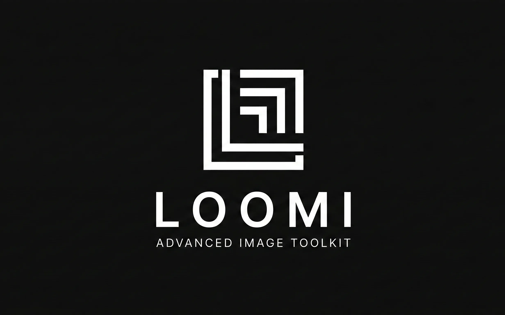

<p align="center">
  
</p>

---
<p align="center">
  
  
  
  
</p>
---

**Loomi** is a modern, dark-themed image toolkit built with a scalable full-stack architecture.

It is designed as a structured, professional-grade image processing platform — starting with format conversion and expanding into a complete suite of image tools.

Currently in active development.

---

## ✨ Current Features

* Image format conversion (PNG, JPEG, WebP, AVIF, GIF, TIFF)
* Drag & drop upload interface
* Image-only validation (frontend + backend)
* Original vs converted file size comparison
* Compression savings percentage display
* Clean industrial dark UI

---

## 🛠 Tech Stack

### Frontend

* Next.js (App Router)
* TypeScript
* Tailwind CSS
* Framer Motion

### Backend

* Express
* TypeScript
* Sharp (image processing)
* Multer (memory-based file handling)
* Layered architecture (routes, controllers, services, middleware)

---

## 🧱 Project Structure

```
Loomi/
├── backend/
│   ├── src/
│   │   ├── routes/
│   │   ├── controllers/
│   │   ├── services/
│   │   ├── middleware/
│   │   ├── app.ts
│   │   └── server.ts
│   └── package.json
│
└── frontend/
    ├── src/
    │   ├── app/
    │   ├── components/
    │   └── lib/
    └── package.json
```

The backend follows a scalable layered architecture to allow future expansion (compressor, background remover, metadata tools, etc.).

---

## 🚀 Running Locally

### 1️⃣ Backend

```
cd backend
npm install
npm run dev
```

Runs on:

```
http://localhost:5000
```

---

### 2️⃣ Frontend

```
cd frontend
npm install
npm run dev
```

Runs on:

```
http://localhost:3000
```

---

## 📌 Roadmap

* [x] Image Converter
* [x] Image Compressor
* [ ] Background Remover
* [ ] Resize Tool
* [ ] Crop Tool
* [ ] Metadata Stripper
* [ ] Bulk Processing
* [ ] Public Deployment

---

## 🎯 Vision

Loomi aims to become a modern, developer-grade image toolkit with:

* Clean architecture
* Strong validation
* Performance-focused processing
* Scalable backend structure
* Premium UI experience

---

## 📄 License

MIT

---
